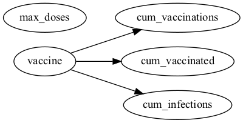

Causal DAG
==========

As in traditional software testing, the specification defines the expected behaviour of the system.
In the Causal Testing Framework, this specification takes the form of a directed acyclic graph (DAG) that sets out the expected causal relationships between variables in a system.
To do this, we use the `DOT language <https://graphviz.org/docs/layouts/dot>`_, which provides an intuitive text-based representation of DAGs in which an edge from node :code:`X` to :code:`Y` is specified as :code:`X -> Y;`.

As an example, consider the DAG for the :doc:`vaccinating the elderly tutorial <../tutorials/vaccinating_elderly/vaccinating_elderly_tutorial>`.
This scenario has two inputs `vaccine` and `max_doses` and three outputs `cum_vaccinations`, `cum_vaccinated`, and `cum_infections`.
We do not expect `max_doses` to have a causal effect on any of the outputs since this remains constant throughout modelling scenario.

.. literalinclude:: ../../../examples/covasim_/vaccinating_elderly/dag.dot
   :language: graphviz
   :caption: **Figure:** Example Causal DAG for the vaccinating the elderly example.

Specifying Causal DAGs
----------------------

Unfortunately, there is very little universally applicable guidance for specifying a DAG, since the expected relationships will vary greatly between systems.
However, if you are in doubt as to whether an edge should be included between a pair of variables, the `advice from the causal inference community <https://miguelhernan.org/whatifbook>`_ is to include the edge.
Is a stronger assumption to exclude an edge (which signifies a known independence between two variables) than to include one (which signifies the possibility of a causal effect).
While you can use our :doc:`causal discovery <causal_discovery>` tools to infer a DAG from a dataset, you should not use this for causal testing without careful examination and validation of the inferred relationships to ensure that they are sensible and meaningful.

Causal Identification
---------------------

A key step in the evaluation of causal test cases is :term:`identification`.
The Causal Testing Framework carries out this process entirely automatically, so you do not need to know the technicalities of this to perform causal testing.
Interested readers can find a technical explanation `here <https://miguelhernan.org/whatifbook>`_, but the process essentially involves inspecting the causal relationships in the DAG and picking out variables which should be *adjusted for* in order to calculate an unbiassed causal effect.

The intuition is embedded in the old adage "correlation does not necessarily imply causation".
A real-world example of this is that we would not expect the number of fans sold on any particular day to have a direct causal effect on the number of ice creams sold --- there is nothing about owning a fan that would inherently compel anyone to buy ice cream.
However, there will be a *correlation* between the two, since both are more likely to be sold when it is hot outside.
Therefore, to test the absence of causality, we must take temperature into account when estimating the causal effect.

In the causal testing framework, the causal DAG not only serves as the specification, but also to perform this identification.
The key benefit of this is that it allows us to use pre-existing datasets that were not specially curated for testing while still maintaining trustworthy test outcomes.
Therefore, it is important that all relevant variables are recorded in the DAG, even if they are missing from the data or cannot be meaningfully recorded.
While this may occasionally require :doc:`special estimation techniques <../modules/causal_estimate>` to adjust for unobserved variables, and may occasionally result in untestable relationships, it prevents biassed causal effect estimates from leading to untrustworthy test outcomes.
