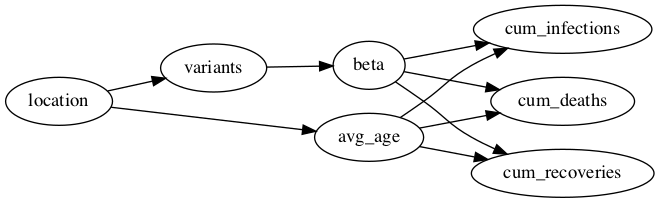

# Example: A COVID-19 Scenario Implemented in Covasim
Covasim is an epidemiological agent-based modelling tool designed to simulate various COVID-19
modelling scenarios, including the roll-out of vaccines and the effect of different variants.

In this example, we will demonstrate how to use the causal testing framework with observational
data collected from the simulations implemented in the Covasim tool. We will focus on a set of
simple modelling scenarios that investigate how the infectiousness of the virus (encoded as the
parameter beta) affects the cumulative number of infections, recoveries, and deaths after a
fixed duration (200 days). For this scenario, we will design a suite of causal test cases that
aim to answer the following causal questions:

1) Does doubling beta cause the number of infections and deaths to increase?
2) Does halving beta cause the number of infections and deaths to decrease?

## Background
Consider a team of epidemiologists that have been tasked with predicting the impact of COVID-19 on various
outcomes (cumulative infections, recoveries, deaths, hospital cases etc.) to help inform government policy
(school closures, work from home etc.). As part of their task, the team are asked to compare the situation 
across multiple countries. At the time of the investigation, different locations had different dominant
strains and therefore the infectiousness of the virus differed between location (as shown in the causal DAG
above). As a result of these tasks, the team have collected a significant amount of data simulating the
pandemic in four different locations - Brazil, India, South Africa, and the UK - each with a different
dominant strain - Gamma, Delta, Beta, and Alpha, respectively.

Before the epidemiologists can recommend policies to the government based on the simulations, they want to
be confident that the simulations are accurate and reliable. In particular, the epidemiologists want to
confirm that intervening upon the infectiousness parameter (beta) causes the expected change in 
the three key outputs: cumulative infections, recoveries, and deaths. However, with the significant time
constraints imposed by the pandemic, the epidemiologists have limited options available to them. While they
could in theory design a large and elaborate test suite that covers much of the critical functionality, it would
require many costly and time-consuming executions of the model that could not be executed in the available
time.

To provide an alternative cost-effective testing method, we will use the causal testing framework to infer the
outcome of test cases from the available observational data. That way, the modellers can provide evidence that
the model behaves as expected without having to repeatedly run costly model executions.

## Method
Since we are using observational data in this example, we need to consider how the data might have been
collected. This is because we have not designed a test case that investigates exactly the
causal effect of beta on infections, recoveries, and deaths by varying only the beta parameter
and observing the results. Instead, we have a set of data in which inputs other than beta are
also changing. Using the causal testing framework, our goal is to infer the causal effect of
beta on the cumulative infections, recoveries, and deaths from this data.

## Causal Specification
In order to apply the causal testing framework to this example, we need to create a causal specification.
We begin this process by specifying the modelling scenario that we wish to test. As described above, we
are interested in the effect of intervening on the beta parameter on the cumulative infections, recoveries,
and deaths. To start with, we will focus on a simple but specific scenario (in the sense that it prescribes
exact values to a small number of input parameters) with the following constraints:
1. A population size of 10000
2. An initial infected population of 100
3. A simulation length of 200 days

Next, we need to create a causal DAG that describes the causal relationships amongst the input and output variables
of the scenario-under-test. Since we are interested in the effect of beta on cumulative infections, recoveries,
and deaths, we can start by adding these variables to the DAG, with an edge from beta to each of the outcomes. Next,
we need to consider variables in the data that might influence both the value of beta (treatment) and the outcomes
(cumulative infections, recoveries, and deaths). For example, we know that different COVID-19 variants have differing
abilities to spread (beta -> variant). In turn, we know that different locations may have different dominant variants
(location -> variant) and that different locations may have different age demographics (location -> age). Finally, we
know that likelihood of infection, recovery, and death all depend on age. It is important to encode this information in
the causal DAG so that the causal testing framework can identify any confounding variables that must be adjusted for
to isolate the causal effect.

Overall, we identified the following relationships:

1) Variant -> Beta: The infectiousness of the virus depends on the variant (strain).
2) Location -> Variant: Different locations may have different dominant variants.
3) Location -> Age: Different locations may have different age demographics.
4) Age -> Cumulative infections: Younger individuals are less susceptible to infection.
5) Age -> Cumulative recoveries: Younger individuals are more likely to recover.
6) Age -> Cumulative deaths: Younger individuals are less likely to die.

Collectively, these relationships form the following causal DAG that will be used in our
causal specification:

## Causal Test Case

